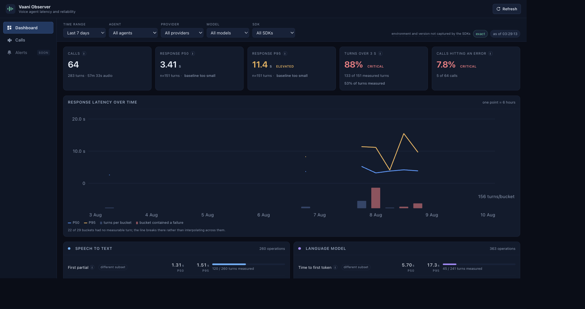

# Vaani Observer for Node.js

> Local-first observability for real-time voice agents.

Capture the STT, LLM, TTS, tool, WebSocket, and audio activity behind a voice
call without putting a network dependency on its live media path. Vaani
Observer writes a portable session package locally, then uploads it explicitly
after the call for review in the [Vaani Observer Dashboard](https://github.com/shubhamofbce/vaanieval-observer-backend).



## What you get

- Provider-neutral operation spans and streaming milestones for STT, LLM, TTS,
  tools, and connection lifetimes.
- Timeline-aligned caller and agent audio, recorded as stereo PCM.
- Safe ambient instrumentation: only traffic inside an active session that
  matches your configured endpoint rules is observed.
- A byte-compatible package format shared with the
  [Python SDK](https://github.com/shubhamofbce/vaanieval-observer-python-sdk).

## Quick start

A deliberately small Python dashboard service lives in its own repository, [`vaanieval-observer-backend`](https://github.com/shubhamofbce/vaanieval-observer-backend), checked out alongside this one as `dashboard/`. It uses SQLite plus local files and implements the SDK's create → upload → complete flow for local development.

```bash
cd ../dashboard
python -m venv .venv
.venv/bin/pip install -r requirements.txt
.venv/bin/uvicorn app.main:app --reload --port 8000
```

Open [http://localhost:8000](http://localhost:8000). Configure the SDK with `endpoint: 'http://localhost:8000'` and `apiKey: 'local-dev'`. The dashboard can enforce minted API keys with `VAANI_REQUIRE_API_KEY=1`.

The console uses a self-contained operation timeline with no CDN dependency. Audio is stored as the SDK's original raw PCM track; the console requests an on-demand WAV wrapper for browser playback without creating a second stored copy. The wrapper is streamed and honours HTTP `Range` requests, which Safari requires before it will play any media response.

This local implementation has purposeful limits: uploads pass through one Python process and are capped at 128 MiB, SQLite/local disk are single-machine storage, and there is no auth or multi-user isolation. Those keep setup simple, but production needs object storage, Postgres, async audio processing, authentication, retention controls, and a CDN-pinned/self-hosted chart asset.

## Instrument a call

```js
import { VaaniObserver } from '@vaanieal/observer';

const vaani = new VaaniObserver({ spoolDirectory: '/tmp/vaani', endpoints: [{ id: 'llm', type: 'llm', url: 'https://llm.example/v1' }] });
const session = vaani.startSession({ agentId: 'support' });
session.recordInboundAudio(pcm, { encoding: 'pcm_s16le', sampleRateHz: 16000, channels: 1 });
await session.run(() => fetch('https://llm.example/v1/chat'));
await session.end({ outcome: 'completed' });
```

Call `await vaani.uploadPackage(await session.end())` when an ingestion endpoint implements the documented `POST /v1/sessions` → direct object upload → `complete` flow. Upload is intentionally explicit and post-call; the library never uploads on the live media path. This release does not publish to npm, but `package.json` contains the required exports, files, engine, and publish access configuration for a later `npm publish`.

Use `startOperation()` for provider-neutral streaming milestones. Operations carry a `scope`: `turn` (the default — one unit of conversational work, grouped by `turn_id`) or `connection` (a provider socket's lifetime). `tool` is supported alongside `stt`, `llm`, and `tts` for internal tool steps. Set `capture.httpBodies: true` to retain HTTP request/response bodies; headers are never persisted. `capture.payloadMaxBytes` caps each retained payload (16 KiB by default). `capture.sttContent` defaults to false: when enabled, the provider adapter should add the final transcript, language, confidence, word timings, and a bounded sample of partials to its per-turn STT operation. For `ws`, call `vaani.observeWebSocket(socket, { session, url })` immediately after construction; it records lifecycle, direction, kind, and byte counts as a `connection`-scoped span, because a streaming socket normally stays open for the whole call. Per-turn work must be recorded explicitly with `session.startTurn()` + `turn.startOperation()`, and `session.withTurn(turnId, fn)` tags auto-instrumented `fetch` calls with the same turn.

Repeated milestones of the same name accumulate (`count`, `occurred_at_ms` of the first, `last_at_ms` of the latest) rather than overwriting, so a high-frequency transport keeps useful timing without one event per frame. `startOperation({ startedAtMs })` back-dates a span whose start is only known in hindsight — for example STT work that began before the turn id was allocated.

For streamed TTS, use the returned operation id to attribute outbound PCM to the
exact reply and, where available, pass the scheduled playout clock:

```js
const tts = session.startOperation({ type: 'tts', turnId: turn.id });
session.recordOutboundAudio(pcm, {
  encoding: 'pcm_s16le', sampleRateHz: 24000, channels: 1,
  turnId: turn.id, operationId: tts.id, playoutAtMs,
});
```

This metadata lets the dashboard retain real gaps between streamed chunks. It is
optional and existing callers remain compatible, but older recordings can only
infer the audible TTS window from the first chunk and rendered PCM duration.

## Tests

```bash
npm test                                            # Node SDK (node:test, no dependencies)

cd ../dashboard
.venv/bin/pip install -r requirements.txt -r requirements-dev.txt
.venv/bin/python -m pytest                          # FastAPI dashboard (pytest + TestClient)
```

Dashboard tests run against a temporary data directory and SQLite file per test, so they never touch `dashboard/data`.
